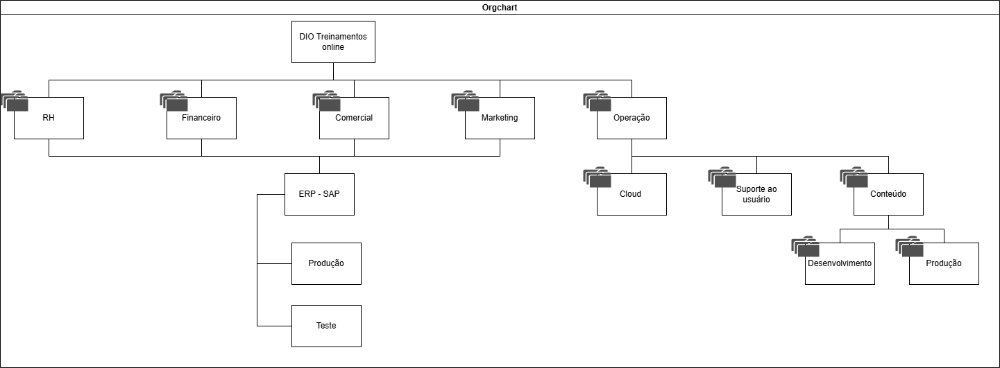

Repositório para desafio DIO
PROPOSTA
Desenhando Sua Organização de Pastas e Projetos e Grupos de Acessos na Google Cloud Platform
Entendendo o Desafio
 Agora é a sua hora de brilhar e construir um perfil de destaque na DIO! Explore todos os conceitos explorados até aqui e replique (ou melhore, porque não?) este projeto prático. Para isso, crie seu próprio repositório e aumente ainda mais seu portfólio de projetos no GitHub, o qual pode fazer toda diferença em suas entrevistas técnicas 😎
 Neste repositório, insira todos os links e arquivos necessários para seu projeto, seja um arquivo de banco de dados ou um link para o template no Figma.
 Dica: Se o expert forneceu um repositório Github, você pode dar um "fork" no repositório dele para organizar suas alterações e evoluções mantendo uma referência direta ao código-fonte original.
 Objetivo do Desafio:
Desenhe uma organização de grupo de acessos e de uma organização utilizando o Draw.io e suba no seu github
Repositório Git
 O Git é um conceito essencial no mercado de trabalho atualmente, por isso sempre reforçamos sua importância em nossa metodologia educacional. Por isso, todo código-fonte desenvolvido durante este conteúdo foi versionado no seguinte endereço para que você possa consultá-lo a qualquer momento:
 github.com/digitalinnovationone/trilha-gcp-fundations-terraform-projetosfolders
 Draw.io
 Faça download do arquivo clicando aqui.
 Bons estudos 😉

 DESENVOLVIMENTO

Desafio DIO: Organização de Pastas, Projetos e Grupos de Acessos na GCP
Este repositório contém a resolução do desafio prático da trilha de Cloud Foundations da DIO. O objetivo é desenhar e documentar a estrutura hierárquica de uma organização na Google Cloud Platform (GCP), aplicando conceitos de governança, isolamento de ambientes e segurança (IAM).

Diagrama da Arquitetura

Modelo visual da organização em o Draw.io:


Planejamento de Governança e Grupos de Acesso (IAM)
Princípio do menor privilégio (*Least Privilege*), a estrutura deve receber os seguintes grupos de acessos e papéis na GCP:

| Grupo de Acesso (Google Groups) | Nível de Aplicação (Escopo) | Papel Sugerido (GCP Role) | Descrição do Acesso |
| :--- | :--- | :--- | :--- |
| `gcp-org-admins@suaempresa.com` | Organização (`DIO Treinamentos`) | `Roles/Organization Admin` | Controle total de toda a árvore de recursos e políticas. |
| `gcp-financas-manager@suaempresa.com` | Pasta `Financeiro` | `Roles/Viewer` ou `Billing Admin` | Visualização de recursos financeiros e controle de faturamento. |
| `gcp-comercial-dev@suaempresa.com` | Pasta `Comercial/ERP - SAP/Teste` | `Roles/Editor` | Permissão para criar e testar recursos apenas no ambiente de homologação/teste do SAP. |
| `gcp-comercial-prod@suaempresa.com` | Pasta `Comercial/ERP - SAP/Produção` | `Roles/Viewer` | Acesso estrito de leitura. Alterações aqui dependem de pipelines de CI/CD automáticas. |
| `gcp-ops-cloud-admin@suaempresa.com` | Pasta `Operação/Cloud` | `Roles/Compute Admin` / `Network Admin` | Administradores da infraestrutura base e redes (VPCs, Cloud DNS, etc). |
| `gcp-conteudo-devs@suaempresa.com` | Pasta `Operação/Conteúdo/Desenvolvimento` | `Roles/Editor` | Desenvolvedores da fábrica de conteúdo com permissão total para criar e destruir recursos em Dev. |

Terraform
A estrutura em código declarativo utilizando Terraform. Os arquivos presentes neste repositório realizam o mapeamento automatizado dos recursos:
providers.tf: Configuração do provedor Google Cloud.
variables.tf: Centralização de variáveis reutilizáveis (como o ID da organização).
main.tf: Criação hierárquica usando os recursos `google_folder` e `google_project`, com subpastas e ambientes de Produção/Teste nos respectivos escopos dinâmicamente.

Aplicar estrutura em GCP, rodando comandos:
```bash
terraform init
terraform plan
terraform apply
