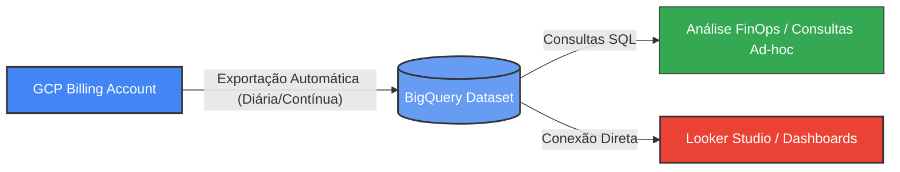

# Desafio 02: Exportação de Billing (Faturamento) da GCP para o BigQuery

[](https://cloud.google.com/)
[](https://cloud.google.com/bigquery)
[](https://lookerstudio.google.com/)

Este desafio prático consiste em configurar o pipeline automatizado de exportação contínua dos dados de faturamento (Billing) do Google Cloud Platform para o BigQuery. Esta configuração é fundamental para governança financeira (FinOps), permitindo auditar custos em tempo real, criar alertas e construir dashboards analíticos de gastos.

---

## 🏗️ Arquitetura da Solução

O fluxo de dados segue o seguinte modelo:



---

## 🔑 Pré-requisitos e Permissões IAM

Para configurar a exportação com sucesso, sua identidade no GCP deve possuir as seguintes permissões básicas:

1. **Conta de Faturamento (Billing Account)**:
   - Papel de **Administrador da Conta de Faturamento** (*Billing Account Administrator*).
2. **Projeto de Destino (onde ficará o BigQuery)**:
   - Papel de **Administrador do BigQuery** (*BigQuery Admin*) ou **Editor do BigQuery** (*BigQuery Editor*).
   - O projeto deve possuir o **Faturamento Ativo** para suportar armazenamento no BigQuery.

---

## 🚀 Passo a Passo da Configuração

### Passo 1: Criar o Dataset no BigQuery
Antes de ativar a exportação, precisamos de um local no BigQuery para receber os dados.
1. No Console da GCP, acesse o menu **BigQuery** > **BigQuery Studio**.
2. Clique nos três pontos ao lado do ID do seu projeto e selecione **Criar conjunto de dados** (*Create dataset*).
3. Defina os seguintes parâmetros:
   - **ID do conjunto de dados**: Um nome descritivo (exemplo: `gcp_billing_data`).
   - **Local dos dados**: Escolha a mesma região onde você roda a maior parte dos seus recursos (ex: `US` ou `southamerica-east1` em São Paulo) para reduzir custos de rede e latência.
   - **Expiração padrão de tabela**: Deixe **Nunca** (*Never*) para manter o histórico de faturamento para sempre.
4. Clique em **Criar conjunto de dados**.

> [!NOTE]
> *Insira abaixo o print de tela do seu Dataset criado:*
> 
> 

---

### Passo 2: Configurar a Exportação no Console de Faturamento
1. Abra o menu de navegação lateral esquerdo do GCP e acesse **Faturamento** (*Billing*).
2. Se você gerenciar mais de uma conta de faturamento, selecione a conta que deseja analisar.
3. No menu lateral de Faturamento, clique em **Exportação de faturamento** (*Billing Export*).
4. Você verá três tipos de exportação disponíveis. Recomenda-se configurar a seguinte opção principal:
   - **Exportação de custo de uso padrão** (*Standard usage cost export*): Mostra dados detalhados de custo e uso (como CPU, memória, storage, etc.).
5. Clique em **Editar Configurações** (*Edit Settings*) na caixa correspondente.
6. Selecione o **Projeto de destino** e o **Conjunto de dados (Dataset)** que você criou no *Passo 1*.
7. Clique em **Salvar** (*Save*).

> [!TIP]
> Para projetos profissionais ou corporativos com uso de labels de recursos (como centros de custos, ambientes dev/prod, owners), configure também a **Exportação de custo de uso detalhado** (*Detailed usage cost export*). Ela inclui o ID dos recursos individuais e as labels vinculadas às instâncias.

> [!NOTE]
> *Insira abaixo o print da tela de configuração do faturamento apontando para o seu BigQuery:*
> 
> 

---

### Passo 3: Aguardar a Geração Automática das Tabelas
Após salvar, a GCP levará de **24 a 48 horas** para começar a exportar os dados e criar as tabelas automaticamente dentro do BigQuery.
Você notará que novas tabelas com o formato `gcp_billing_export_v1_<ACCOUNT_ID>` serão geradas no dataset.

> [!NOTE]
> *Insira abaixo o print mostrando as tabelas geradas no BigQuery Studio após o período de maturação:*
> 
> 

---

## 📊 Consultando os Dados com SQL

Após a exportação estar ativa e com dados populados, você pode rodar consultas avançadas para extrair insights.

Neste repositório, criamos uma pasta com scripts prontos para você utilizar: [billing_analysis.sql](file:///c:/Users/Chericoni/DIO/dio_gcp/02-exportacao-billing-bigquery/queries/billing_analysis.sql). 

### Exemplo Rápido: Custo por Serviço GCP
Substitua `SEU_PROJETO.SEU_DATASET.gcp_billing_export_v1_XXXXXX` pela sua tabela real e rode no console do BigQuery:

```sql
SELECT
  service.description AS servico,
  ROUND(SUM(cost), 2) AS custo_bruto,
  ROUND(SUM(cost + (SELECT SUM(c.amount) FROM UNNEST(credits) c)), 2) AS custo_liquido,
  currency AS moeda
FROM
  `SEU_PROJETO.SEU_DATASET.gcp_billing_export_v1_XXXXXX`
GROUP BY
  servico,
  moeda
ORDER BY
  custo_liquido DESC;
```

> [!NOTE]
> *Insira abaixo o print da sua primeira query executada com sucesso:*
> 
> 

---

## 🎨 Próximo Passo: Visualização no Looker Studio (Opcional)

Uma das maiores vantagens de exportar o Billing para o BigQuery é a facilidade de gerar gráficos dinâmicos e dashboards no **Looker Studio**:
1. Vá até o [Looker Studio](https://lookerstudio.google.com/).
2. Clique em **Criar** > **Relatório**.
3. Selecione o conector **BigQuery**.
4. Navegue até o seu Projeto > Dataset > Tabela de faturamento e clique em **Adicionar**.
5. Crie gráficos de linha (para tendência de custo diário) e gráficos de pizza (para ver os serviços que mais gastam).

> [!NOTE]
> *Insira abaixo o print do seu painel do Looker Studio montado (Opcional, mas agrega muito destaque ao seu portfólio!):*
> 
> 

---

## 📁 Estrutura de Arquivos Deste Desafio

- [README.md](file:///c:/Users/Chericoni/DIO/dio_gcp/02-exportacao-billing-bigquery/README.md) -> Instruções do desafio e passo a passo (Este arquivo).
- [queries/billing_analysis.sql](file:///c:/Users/Chericoni/DIO/dio_gcp/02-exportacao-billing-bigquery/queries/billing_analysis.sql) -> Consultas prontas para você rodar no BigQuery.
- `images/` -> Pasta onde você deve colar os prints das suas telas seguindo as instruções acima.
