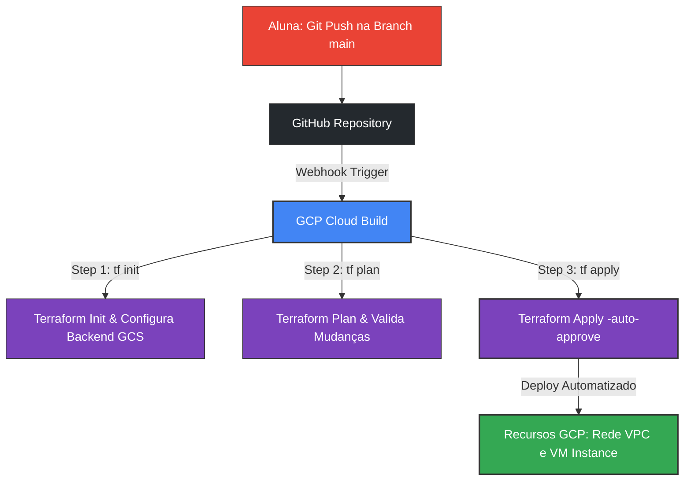

# Desafio 05: Pipeline de CI/CD com Cloud Build e Terraform

[](https://cloud.google.com/build)
[](https://www.terraform.io/)
[](https://cloud.google.com/build)

Este desafio prático consiste em estruturar e configurar um pipeline completo de **Integração e Entrega Contínua (CI/CD)** na GCP utilizando o **Cloud Build** para automatizar o provisionamento de infraestrutura definida via **Terraform (IaC)**.

---

## 🏗️ Arquitetura do Pipeline

O fluxo de automação segue o seguinte ciclo de vida DevSecOps:



---

## 🔑 Pré-requisitos e Permissões IAM (Crítico)

Para que o Cloud Build consiga executar os comandos do Terraform e criar recursos na sua conta, é necessário configurar as credenciais corretas.

### 1. Criar o Bucket GCS para Armazenar o State do Terraform
O estado (`.tfstate`) do Terraform precisa ser compartilhado e mantido de forma segura na nuvem. A Google recomenda utilizar a nova CLI `gcloud storage` em vez do utilitário legado `gsutil`.

**Comandos Modernos (Recomendado pela Google):**
```bash
# 1. Criar o bucket na região desejada
gcloud storage buckets create gs://bucketdio --location=us-central1

# 2. Habilitar o versionamento para maior segurança do estado
gcloud storage buckets update gs://bucketdio --versioning
```

**Comandos Legados (Com gsutil):**
```bash
gsutil mb -l us-central1 gs:/bucketdio
gsutil versioning set on gs://bucketdio
```

> [!TIP]
> No laboratório atual, o bucket **`gs://bucketdio`** foi criado e configurado com versionamento com sucesso!

### 2. Conceder Acesso ao Cloud Build Service Account
Por padrão, a conta de serviço do Cloud Build possui permissões limitadas. Precisamos dar a ela os acessos necessários para criar VMs, Redes e gerenciar o bucket de state.
1. No console da GCP, acesse **IAM e Administrador** > **IAM**.
2. Encontre a conta de serviço com o sufixo `@cloudbuild.gserviceaccount.com` (ex: `123456789012@cloudbuild.gserviceaccount.com`).
3. Clique em editar (lápis) e adicione as seguintes funções (Roles):
   - **Administrador do Storage** (*Storage Admin*): Para salvar/ler o arquivo de state no bucket.
   - **Administrador do Compute** (*Compute Admin*): Para criar e deletar instâncias de VM.
   - **Administrador de Rede do Compute** (*Compute Network Admin*): Para criar e gerenciar a VPC.

---

## 🛠️ Estrutura dos Arquivos Deste Desafio

A pasta do desafio está dividida da seguinte forma:
* [cloudbuild.yaml](file:///c:/Users/Chericoni/DIO/dio_gcp/05-pipeline-cicd-cloudbuild-terraform/cloudbuild.yaml): Configuração dos passos do pipeline (Init, Plan, Apply).
* **`terraform/`**: Pasta com o código declarativo da infraestrutura:
  - [main.tf](file:///c:/Users/Chericoni/DIO/dio_gcp/05-pipeline-cicd-cloudbuild-terraform/terraform/main.tf): Declaração da VPC, VM Compute Engine e do backend remoto do GCS.
  - [variables.tf](file:///c:/Users/Chericoni/DIO/dio_gcp/05-pipeline-cicd-cloudbuild-terraform/terraform/variables.tf): Definição de variáveis como região, zona, nome de rede e centro de custo.
  - [outputs.tf](file:///c:/Users/Chericoni/DIO/dio_gcp/05-pipeline-cicd-cloudbuild-terraform/terraform/outputs.tf): Declaração das saídas (IPs interno e externo da máquina criada).

> [!NOTE]
> Os arquivos locais de Terraform na pasta `terraform/` já foram personalizados automaticamente por mim com o seu bucket **`bucketdio`** e o seu ID de projeto GCP **`notebook-mastera`**! Nenhuma alteração manual adicional é necessária nesses arquivos.

---

## 🚀 Como Configurar o Gatilho (Trigger) no GCP Console

1. No console da GCP, vá em **Cloud Build** > **Gatilhos** (*Triggers*).
2. Clique em **Conectar Repositório** (*Connect Repository*):
   - Selecione o **GitHub (Cloud Build GitHub App)**.
   - Autentique sua conta do GitHub e selecione o repositório `dio_gcp`.
3. Clique em **Criar Gatilho** (*Create Trigger*):
   - **Nome**: `terraform-pipeline-deploy`
   - **Evento**: **Enviar para uma ramificação** (*Push to a branch*)
   - **Origem**: Repositório conectado, Ramificação: `^main$`
   - **Configuração**: **Arquivo de configuração do Cloud Build (YAML ou JSON)**
   - **Caminho do arquivo do Cloud Build**: `05-pipeline-cicd-cloudbuild-terraform/cloudbuild.yaml`
4. Clique em **Criar**.

> [!NOTE]
> *Insira abaixo o print de tela do seu Gatilho do Cloud Build configurado:*
> 
> 

---

## 🏁 Executando e Validando a Pipeline

1. No seu terminal local na pasta do repositório, faça um commit e envie para a branch `main`:
   ```bash
   git add .
   git commit -m "feat: adiciona desafio 05 pipeline ci/cd terraform cloud build"
   git push origin main
   ```
2. No console da GCP, acesse **Cloud Build** > **Histórico** (*History*) para acompanhar o build em tempo real.
3. Você verá os 3 steps sendo executados de forma sequencial com sucesso (`tf init`, `tf plan` e `tf apply`).

> [!NOTE]
> *Insira abaixo o print de tela mostrando a execução bem sucedida da pipeline no console:*
> 
> 

4. Acesse **Compute Engine** > **Instâncias de VM** para comprovar que a máquina `terraform-instance` foi criada automaticamente pela pipeline!

> [!NOTE]
> *Insira abaixo o print dos recursos da GCP criados automaticamente via pipeline:*
> 
> 
