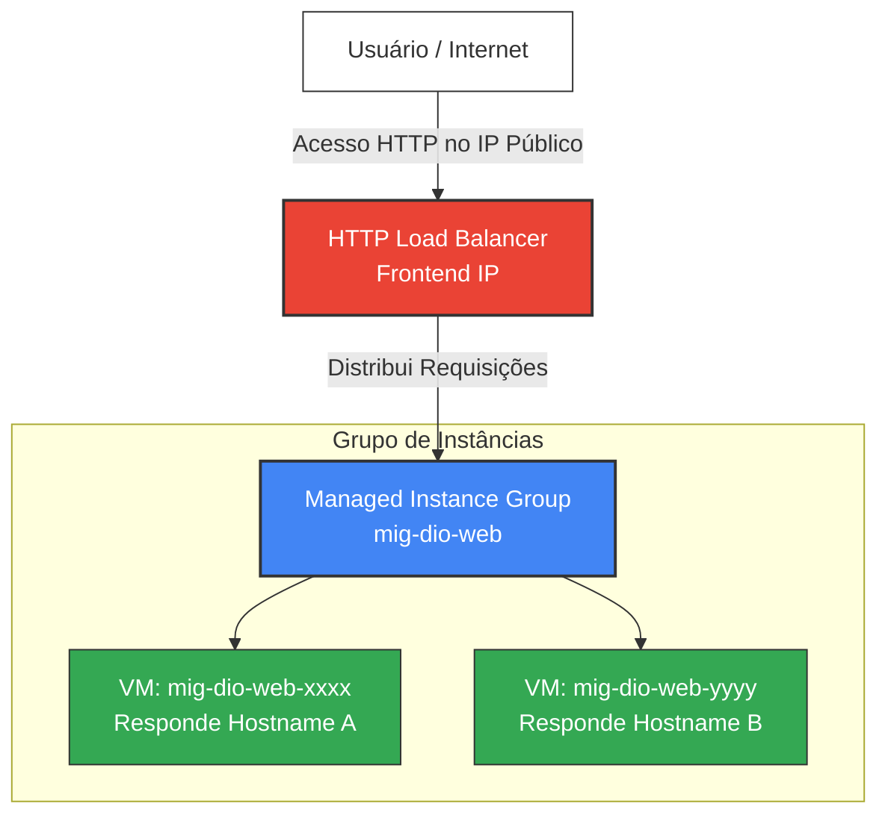

# Desafio 07: Instance Template, Instance Group e Load Balancer na GCP

[](https://cloud.google.com/compute)
[](https://cloud.google.com/load-balancing)
[](https://cloud.google.com/)

Este desafio prático demonstra como construir uma arquitetura de **Alta Disponibilidade e Escalabilidade** na GCP utilizando a solução mais simples possível:
1. Um **Instance Template** (Template de Instância) que serve de molde para as máquinas.
2. Um **Managed Instance Group (MIG)** (Grupo de Instâncias Gerenciado) para escalabilidade automática (Autoscaling) e autorregeneração (Auto-healing).
3. Um **HTTP Load Balancer** (Balanceador de Carga) como ponto de entrada único para distribuir requisições entre as máquinas.

---

## 🏗️ Arquitetura da Solução

O fluxo de tráfego segue a estrutura abaixo:



---

## 🚀 Passo a Passo Prático no Console GCP

### Passo 1: Criar o Instance Template (Molde)
O Template define a receita das nossas máquinas virtuais (disco, rede, tags e o script de inicialização do Apache).

1. No console da GCP, acesse **Compute Engine** > **Modelos de instância** (*Instance templates*).
2. Clique em **Criar modelo de instância** (*Create instance template*).
3. Configure os seguintes parâmetros simples:
   - **Nome**: `template-dio-web`
   - **Tipo de máquina**: `e2-micro` (Econômico e leve)
   - **Firewall**: Marque a caixa **Permitir tráfego HTTP** (Isso ativa a tag `http-server` necessária)
   - **Opções Avançadas** > **Gerenciamento** > **Metadados** > **Script de Inicialização** (*Startup script*): Copie e cole o conteúdo simplificado de [startup.sh](file:///c:/Users/Chericoni/DIO/dio_gcp/07-templates-groups-loadbalancer/scripts/startup.sh).
4. Clique em **Criar**.

> [!NOTE]
> *Insira abaixo o print de tela do seu Template de Instância criado com sucesso:*
> 
> 

---

### Passo 2: Criar o Managed Instance Group (MIG)
O Grupo Gerenciado cria e destrói instâncias automaticamente com base no nosso Template e monitora a saúde das instâncias.

1. No menu lateral, acesse **Compute Engine** > **Grupos de instâncias** (*Instance groups*).
2. Clique em **Criar grupo de instâncias** (*Create instance group*).
3. Selecione **Novo grupo de instâncias gerenciado (sem estado)** (*New managed instance group - stateless*).
4. Preencha com as seguintes opções simples:
   - **Nome**: `mig-dio-web`
   - **Modelo de instância**: Selecione `template-dio-web`
   - **Locais**: **Zona única** (*Single-zone*). Escolha uma zona (ex: `us-central1-c`)
   - **Escalonamento Automático** (*Autoscaling*):
     * **Número mínimo de instâncias**: `2` (Para termos pelo menos duas VMs rodando e podermos testar o balanceamento)
     * **Número máximo de instâncias**: `3`
     * **Métrica**: Uso de CPU em `60%`
   - **Verificação de integridade** (*Health check*):
     * Clique no menu e selecione **Criar uma verificação de integridade**:
       - Nome: `hc-http-80`
       - Protocolo: `HTTP`
       - Porta: `80`
       - Clique em **Salvar**.
5. Clique em **Criar** e aguarde de 2 a 3 minutos para que o GCP crie as duas instâncias automáticas baseadas no molde.

> [!NOTE]
> *Insira abaixo o print do seu Grupo de Instâncias Gerenciado mostrando as VMs criadas ativas:*
> 
> 

---

### Passo 3: Criar o HTTP Load Balancer
O Balanceador de Carga recebe todas as requisições em um único IP externo e distribui o tráfego de forma inteligente para o grupo de máquinas.

1. No menu de rede da GCP, acesse **Serviços de rede** > **Balanceamento de carga** (*Load balancing*).
2. Clique em **Criar balanceador de carga** (*Create load balancer*).
3. Na caixa **Balanceamento de carga HTTP(S)**, clique em **Iniciar configuração** (*Start configuration*).
4. Selecione **Balanceador de carga HTTP(S) clássico** e marque **Da Internet para minhas VMs** (*From Internet to my VMs*). Clique em **Continuar**.
5. Defina as configurações:
   - **Nome do LB**: `lb-dio-web`
   - **Configuração de back-end** (*Backend configuration*):
     * Clique em **Serviços de back-end** > **Criar um serviço de back-end**:
       - Nome: `backend-dio-web`
       - Tipo de back-end: **Grupos de instâncias**
       - Back-ends: Selecione o grupo `mig-dio-web` e defina a porta como `80`.
       - Verificação de integridade (*Health Check*): Selecione o `hc-http-80` criado no Passo 2.
       - Clique em **Criar**.
   - **Configuração de front-end** (*Frontend configuration*):
     * Nome: `frontend-dio-http`
     * Protocolo: `HTTP`, Porta: `80`, Versão do IP: `IPv4`
6. Clique em **Criar** e aguarde a implantação do Balanceador (isso pode levar cerca de 3 a 5 minutos na GCP).

> [!NOTE]
> *Insira abaixo o print das configurações do seu Load Balancer ativado no console:*
> 
> 

---

### Passo 4: Testar o Balanceamento de Carga
1. Vá até a lista de Balanceamento de Carga e copie o **IP do Front-end** gerado para o `lb-dio-web`.
2. Abra seu navegador e acesse: `http://[IP-DO-LOAD-BALANCER]`.
3. Você verá a página web do Apache exibindo o nome de uma das VMs do seu grupo (ex: `mig-dio-web-xxxx`).
4. **Atualize a página (F5)** ou abra em uma janela anônima. O nome da máquina exibida deverá alternar (ex: `mig-dio-web-yyyy`), comprovando que o Load Balancer está distribuindo o tráfego com sucesso!

> [!NOTE]
> *Insira abaixo o print do seu navegador exibindo a página web do teste e mostrando a alternância de VMs:*
> 
> 

---

## 🛠️ Implantação Rápida via CLI (Cloud Shell)

Você pode provisionar toda essa arquitetura executando estes comandos simples e diretos no seu Cloud Shell:

```bash
# 1. Criar o modelo de instância (Template)
gcloud compute instance-templates create template-dio-web \
    --machine-type=e2-micro \
    --image-family=debian-11 \
    --image-project=debian-cloud \
    --tags=http-server \
    --metadata-from-file=startup-script=scripts/startup.sh

# 2. Criar o health check de monitoramento
gcloud compute health-checks create http hc-http-80 --port=80

# 3. Criar o grupo gerenciado de instâncias (MIG) com tamanho inicial de 2 VMs
gcloud compute instance-groups managed create mig-dio-web \
    --template=template-dio-web \
    --size=2 \
    --zone=us-central1-c \
    --health-check=hc-http-80

# 4. Criar o serviço de backend do Load Balancer
gcloud compute backend-services create backend-dio-web \
    --protocol=HTTP \
    --port-name=http \
    --health-checks=hc-http-80 \
    --global

# 5. Adicionar o grupo de instâncias ao serviço de backend
gcloud compute backend-services add-backend backend-dio-web \
    --instance-group=mig-dio-web \
    --instance-group-zone=us-central1-c \
    --global

# 6. Criar o mapa de URLs e o proxy HTTP
gcloud compute url-maps create map-dio-web --default-service=backend-dio-web
gcloud compute target-http-proxies create proxy-dio-web --url-map=map-dio-web

# 7. Criar a regra de encaminhamento global (Frontend IP)
gcloud compute forwarding-rules create lb-dio-web \
    --global \
    --target-http-proxy=proxy-dio-web \
    --ports=80
```

---

## 📁 Estrutura de Arquivos Deste Desafio

- [README.md](file:///c:/Users/Chericoni/DIO/dio_gcp/07-templates-groups-loadbalancer/README.md) -> Guia passo a passo explicativo (Este arquivo).
- [scripts/startup.sh](file:///c:/Users/Chericoni/DIO/dio_gcp/07-templates-groups-loadbalancer/scripts/startup.sh) -> Script de inicialização dos servidores web.
- `images/` -> Pasta reservada para os prints das suas telas.
