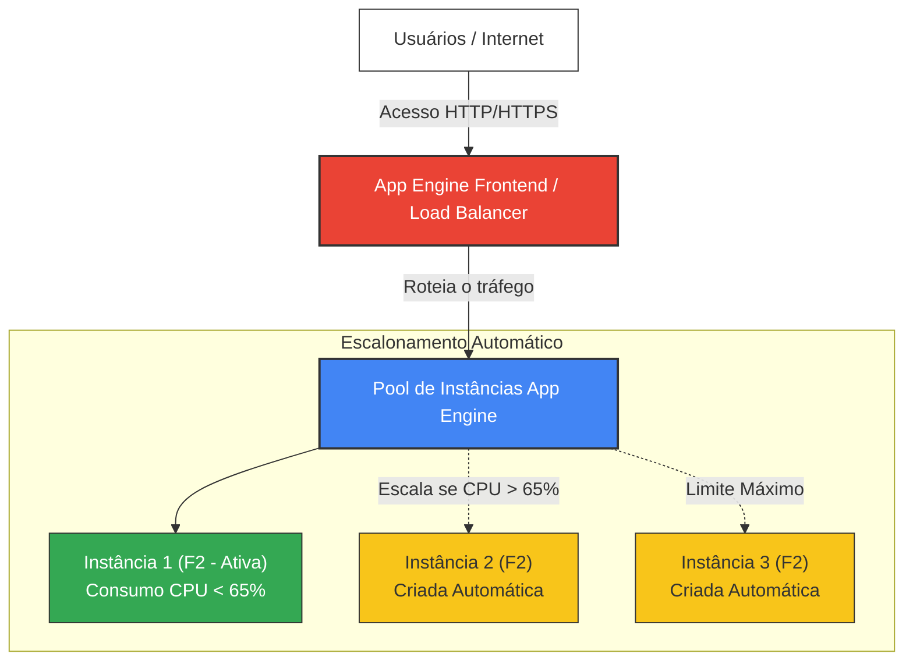

# Desafio 08: Deploy no App Engine com Classe de Instância Personalizada e Auto Scaling

[](https://cloud.google.com/appengine)
[](https://nodejs.org/)
[](https://cloud.google.com/)

Este desafio prático demonstra como realizar o deploy de uma aplicação no **Google App Engine (Standard)** utilizando a solução mais simples possível, configurando uma classe de instância personalizada (`F2`) e parâmetros de escalabilidade automática (`automatic_scaling`).

---

## 🏗️ Arquitetura da Solução

O Google App Engine Standard gerencia automaticamente o balanceamento de carga, provisionamento de instâncias e escalabilidade com base nas configurações que passamos no arquivo `app.yaml`:



---

## 📘 O que é o App Engine e por que personalizar?

O **Google App Engine (GAE)** é uma plataforma como serviço (PaaS) totalmente gerenciada Serverless. Isso significa que você foca apenas no código, e o Google cuida da infraestrutura subjacente.

### ⚙️ Classe de Instância (Instance Class)
Por padrão, o App Engine Standard utiliza a classe de instância **`F1`** (256MB de memória e 600MHz de limite de CPU). Para aplicações mais robustas que realizam processamento de imagens, cálculos ou que precisam de menor latência de inicialização, podemos personalizar a classe:
- **`F2`**: Oferece **512MB** de memória RAM e **1.2GHz** de limite de CPU.
- **`F4`**: Oferece **1024MB** de memória RAM e **2.4GHz** de limite de CPU.

### 📈 Escalonamento Automático (Automatic Scaling)
O auto-scaling monitora métricas de performance (como uso de CPU ou latência de requisição) e adiciona ou remove instâncias dinamicamente para atender à demanda, garantindo alta disponibilidade ao menor custo possível.

---

## 🚀 Passo a Passo Prático para Deploy (Via Cloud Shell)

### Passo 1: Habilitar a API do App Engine
Se for a primeira vez utilizando o App Engine no seu projeto GCP:
1. Abra o **Cloud Shell**.
2. Execute o comando para ativar a API correspondente:
   ```bash
   gcloud services enable appengine.googleapis.com
   ```

### Passo 2: Criar a Aplicação App Engine na sua Região
O App Engine exige a inicialização da aplicação em uma região geográfica específica.
1. No Cloud Shell, execute o comando:
   ```bash
   gcloud app create --region=us-central1
   ```

### Passo 3: Preparar os Arquivos
Certifique-se de que os seguintes arquivos estejam no seu diretório de deploy:
- [app.yaml](file:///c:/Users/Chericoni/DIO/dio_gcp/08-deploy-appengine-scaling/app.yaml) -> Define o runtime (Node.js 18), a classe de instância personalizada (`F2`) e as regras de auto-scaling.
- [server.js](file:///c:/Users/Chericoni/DIO/dio_gcp/08-deploy-appengine-scaling/server.js) -> O código do servidor web nativo Node.js.
- [package.json](file:///c:/Users/Chericoni/DIO/dio_gcp/08-deploy-appengine-scaling/package.json) -> Metadados do projeto.

### Passo 4: Realizar o Deploy da Aplicação
1. Navegue até a pasta do desafio:
   ```bash
   cd 08-deploy-appengine-scaling
   ```
2. Execute o comando de deploy:
   ```bash
   gcloud app deploy app.yaml --quiet
   ```
3. Aguarde de 1 a 2 minutos até que o Google Cloud termine o upload do código, empacotamento e ativação da aplicação.

> [!NOTE]
> *Insira abaixo o print dos logs do seu terminal Cloud Shell demonstrando a conclusão do deploy com sucesso:*
> 
> 

---

## 🔍 Verificação no Console GCP

### Passo 1: Acessar a aplicação ativa
No final do deploy, o terminal fornecerá um link semelhante a `https://[SEU_PROJETO_ID].uc.r.appspot.com`. Você também pode abrir o navegador diretamente usando:
```bash
gcloud app browse
```

> [!NOTE]
> *Insira abaixo o print do seu navegador exibindo a página web da sua aplicação App Engine ativa:*
> 
> 

### Passo 2: Verificar a Classe de Instância e Configurações de Escalonamento
1. No console da GCP, busque por **App Engine** > **Versões** (*Versions*).
2. Verifique a tabela de versões ativas da sua aplicação:
   - A coluna **Classe de instância** (*Instance class*) deverá exibir **`F2`**.
   - Na aba de detalhes ou configurações, você poderá conferir o mínimo de 1 instância e o máximo de 3 instâncias configuradas no seu `app.yaml`.

> [!NOTE]
> *Insira abaixo o print de tela do painel do App Engine mostrando a classe de instância F2 ativa:*
> 
> 

---

## 📁 Estrutura de Arquivos Deste Desafio

- [README.md](file:///c:/Users/Chericoni/DIO/dio_gcp/08-deploy-appengine-scaling/README.md) -> Guia passo a passo explicativo (Este arquivo).
- [app.yaml](file:///c:/Users/Chericoni/DIO/dio_gcp/08-deploy-appengine-scaling/app.yaml) -> Arquivo de parametrização da nuvem.
- [server.js](file:///c:/Users/Chericoni/DIO/dio_gcp/08-deploy-appengine-scaling/server.js) -> Script do servidor Node.js.
- [package.json](file:///c:/Users/Chericoni/DIO/dio_gcp/08-deploy-appengine-scaling/package.json) -> Gerenciador de inicialização do Node.js.
- `images/` -> Pasta reservada para os prints das suas telas.
