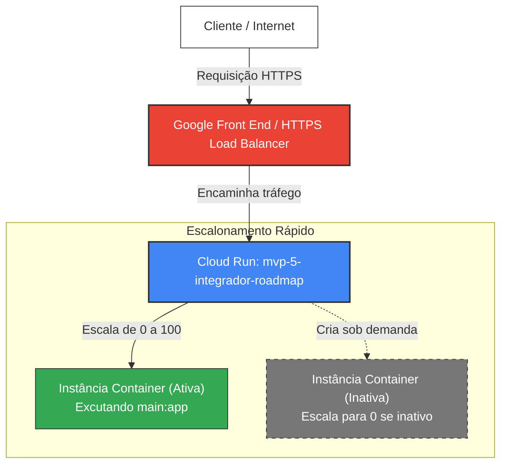

# Desafio 09: Deploy de Aplicação em Container no Google Cloud Run

[](https://cloud.google.com/run)
[](https://www.docker.com/)
[](https://fastapi.tiangolo.com/)

Este desafio prático demonstra como construir a imagem Docker e realizar o deploy Serverless de uma API em container utilizando o **Google Cloud Run**, com base nas configurações reais aplicadas no serviço da **API Mastera - Integrador e Roadmap**.

---

## 🏗️ Arquitetura de Containers Serverless

O Google Cloud Run é uma plataforma totalmente gerenciada que executa seus containers diretamente em cima da infraestrutura do Google, escalando de **zero a N instâncias** de forma extremamente veloz e cobrando apenas pelo tempo exato de processamento das requisições.



---

## 📘 O que é o Cloud Run e por que usá-lo?

O **Cloud Run** une o melhor de dois mundos: a flexibilidade dos **Containers (Docker)** com a simplicidade do modelo **Serverless**.

### 🌟 Vantagens Principais:
* **Escalonamento para Zero (Scale to Zero)**: Se a sua API não estiver recebendo requisições, nenhuma instância de container estará rodando, o que **reduz o custo a zero centavos** em períodos de inatividade.
* **HTTPS Nativo**: O Cloud Run gera automaticamente uma URL pública segura com certificado TLS/SSL gerenciado pela Google.
* **Execução Portável**: Como a aplicação está dentro de um container Docker, ela pode rodar da mesma forma localmente, na GCP, ou em qualquer outra nuvem.

---

## 🚀 Passo a Passo Prático (CLI e Cloud Shell)

Abaixo está o roteiro mais simples e direto para compilar o container no **Artifact Registry** utilizando o **Cloud Build** e fazer o deploy no **Cloud Run**.

### Passo 1: Preparar o Código e o Dockerfile
Certifique-se de que os arquivos do container estejam presentes:
* [main.py](file:///c:/Users/Chericoni/DIO/dio_gcp/09-deploy-container-cloud-run/main.py): A sua API Mastera (FastAPI).
* [Dockerfile](file:///c:/Users/Chericoni/DIO/dio_gcp/09-deploy-container-cloud-run/Dockerfile): Define o build do container.
* [requirements.txt](file:///c:/Users/Chericoni/DIO/dio_gcp/09-deploy-container-cloud-run/requirements.txt): As dependências Python da aplicação.

### Passo 2: Habilitar as APIs Necessárias
No Cloud Shell, ative as APIs do Artifact Registry, do Cloud Build e do Cloud Run:
```bash
gcloud services enable artifactregistry.googleapis.com \
                       cloudbuild.googleapis.com \
                       run.googleapis.com
```

### Passo 3: Criar um Repositório no Artifact Registry
Crie um repositório Docker na região `us-west1` (mesma região do seu deploy):
```bash
gcloud artifacts repositories create dio-repo \
    --repository-format=docker \
    --location=us-west1 \
    --description="Repositório Docker para Desafios DIO"
```

### Passo 4: Compilar a Imagem via Cloud Build
Envie os arquivos locais para serem compilados na nuvem do Google e salvos no Artifact Registry:
```bash
gcloud builds submit --tag us-west1-docker.pkg.dev/projeto-rag-validacao/dio-repo/mvp-5-integrador-roadmap:latest
```

### Passo 5: Fazer o Deploy no Cloud Run
Instancie o container como um serviço público de forma Serverless:
```bash
gcloud run deploy mvp-5-integrador-roadmap \
    --image=us-west1-docker.pkg.dev/projeto-rag-validacao/dio-repo/mvp-5-integrador-roadmap:latest \
    --region=us-west1 \
    --allow-unauthenticated \
    --min-instances=0 \
    --max-instances=100
```

*Nota: O parâmetro `--allow-unauthenticated` torna a API pública na Internet, e o `--min-instances=0` ativa o scale-to-zero para economia máxima de custos.*

---

## 🔍 Resultados Obtidos (Prints Reais do Usuário)

### 1. Documentação Swagger Ativa (API Mastera)
Abaixo está a interface interativa do Swagger no caminho `/docs`, gerada nativamente pelo FastAPI, comprovando que todos os métodos e esquemas da aplicação estão operacionais:


### 2. URL Pública Gerada
A URL gerada de forma segura com HTTPS pelo Cloud Run (`https://mvp-5-integrador-roadmap-XXXXXXX.us-west1.run.app/docs`) respondendo de forma ultra rápida no navegador:


### 3. Detalhes do Serviço no Console GCP
Painel administrativo do **Cloud Run** sob o projeto **`projeto-rag-validacao`** na região **`us-west1`**, exibindo o histórico de builds de sucesso, gráficos de observabilidade, e a configuração de instâncias do auto-scaling:


---

## 📁 Estrutura de Arquivos Deste Desafio

* [README.md](file:///c:/Users/Chericoni/DIO/dio_gcp/09-deploy-container-cloud-run/README.md) -> Roteiro didático e documentação dos prints (Este arquivo).
* [main.py](file:///c:/Users/Chericoni/DIO/dio_gcp/09-deploy-container-cloud-run/main.py) -> Código da API Mastera mockado.
* [Dockerfile](file:///c:/Users/Chericoni/DIO/dio_gcp/09-deploy-container-cloud-run/Dockerfile) -> Definição de empacotamento do container.
* [requirements.txt](file:///c:/Users/Chericoni/DIO/dio_gcp/09-deploy-container-cloud-run/requirements.txt) -> Bibliotecas Python.
* `images/` -> Pasta contendo os prints reais da sua infraestrutura Cloud Run.
